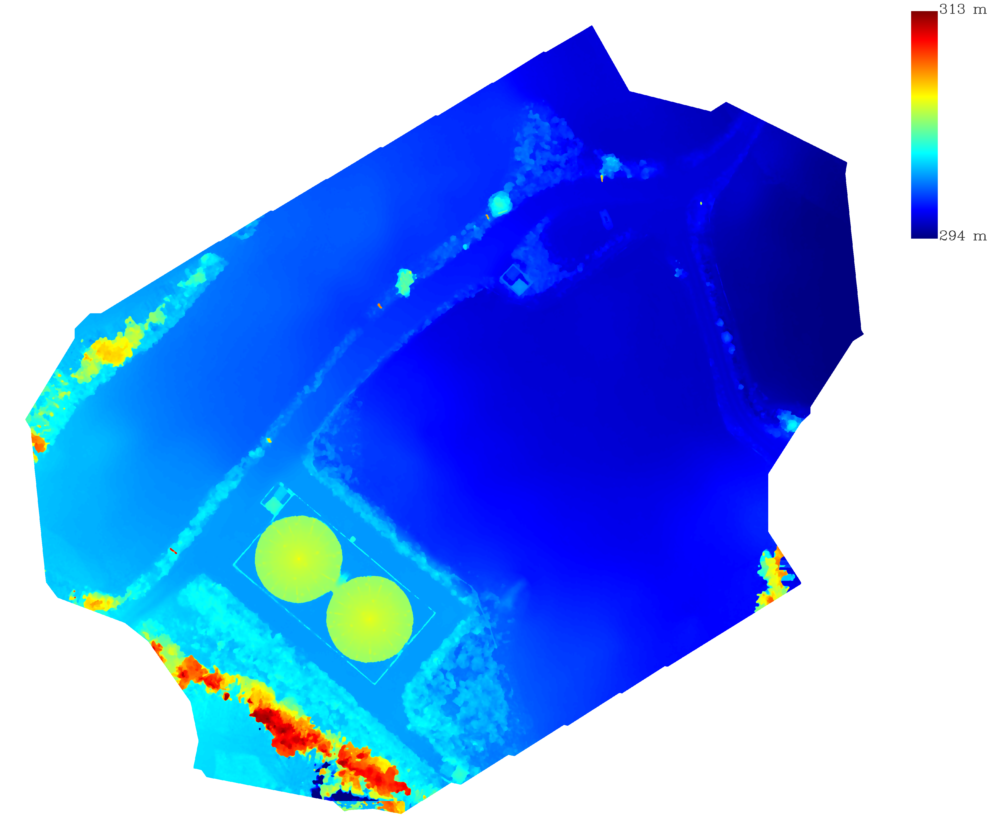
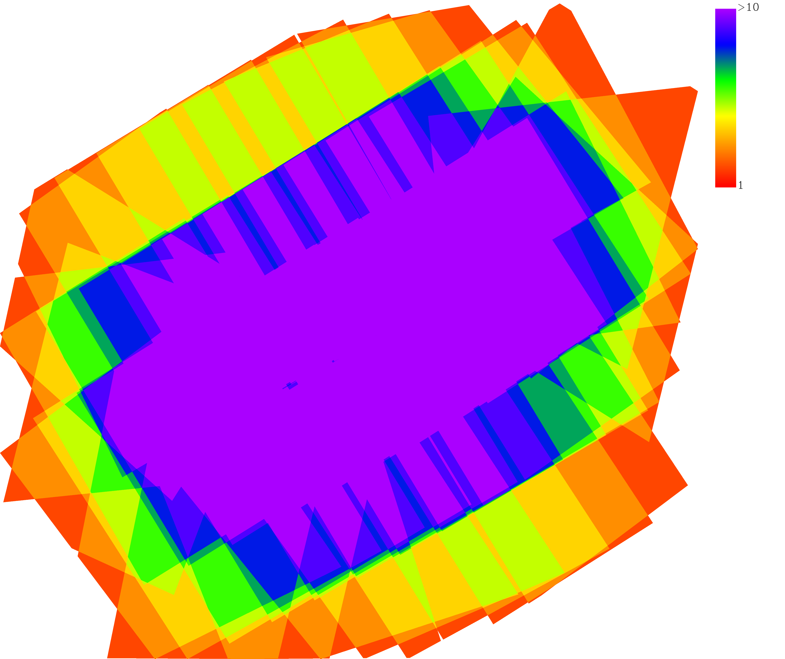

# DJI Terra Aerial Triangulation Quality Report

---
## Image Information Overview

| Item                    | Value           |
| :---: | :---: |
| # Input Images          |              143|
| # Image With Position   |              143|
| # Calibrated Images     |              143|
| Use Image Position | True|
| Georeferencing RMSE |   0.298 m|
| # Connected Components     |            1|
| # Max Component Images     |          143|
| Use Cluster    | No|
| Generate XML   | Yes|
| Use Stereo Mode    | No|
| # feature quantity | Medium|
| SFM Time          |        3.252 min|

## RTK Status

| Status  | Number of Images |
| :---: | :---: |
| FIX     |                0|
| FLOAT   |                0|
| SINGLE  |              143|
| NONE    |                0|

## Camera Calibration Information

Camera Model M3T_WideCamera 

Camera SN 1581F5FJD236600D7RR4 

| Item     | Focal   | Cx      | Cy      |   K1  |   K2  |   K3  |   K4  |   P1  |   P2  |
| :---:    | :---:   | :---:   | :---:   | :---: | :---: | :---: | :---: | :---: | :---: |
| Initial  | 2890.00| 2000.00| 1500.00| 0.17285197| -0.42744389| 0.21868222| 0.00000000| -0.00014433| -0.00014340|

| Block     | Item     | Focal   | Cx      | Cy      | K1    |   K2  |   K3  |   K4  |   P1  |  P2   |
| :---:     | :---:    | :---:   | :---:   | :---:   | :---: | :---: | :---: | :---: | :---: | :---: |
|     0 | Optimized| 2863.96| 1970.86| 1531.60| 0.18512475| -0.44507416| 0.22850028| 0.00000000| 0.00019259| 0.00017805|

Coefficients and correlation matrix 

|      | Error | F     | Cx    | Cy    | K1    | K2    | K3    | P1    | P2    |
|:---: | :---: | :---: | :---: | :---: | :---: | :---: | :---: | :---: | :---: |
| F  | 0.10268414| 1.00000000| 0.04479832| -0.84716523| -0.09664631| -0.01027949| 0.00337333| 0.44203138| 0.00313143|
| Cx  | 0.04173413| 0.04479832| 1.00000000| -0.03803426| 0.00949714| -0.00820978| 0.00195629| 0.02034644| 0.81927645|
| Cy  | 0.08419090| -0.84716523| -0.03803426| 1.00000000| -0.09819854| 0.15731060| -0.13259868| -0.12750468| -0.00496547|
| K1  | 0.00008735| -0.09664631| 0.00949714| -0.09819854| 1.00000000| -0.96303227| 0.90880902| -0.05114640| 0.00264414|
| K2  | 0.00027316| -0.01027949| -0.00820978| 0.15731060| -0.96303227| 1.00000000| -0.98290923| -0.05696336| 0.00420522|
| K3  | 0.00025214| 0.00337333| 0.00195629| -0.13259868| 0.90880902| -0.98290923| 1.00000000| 0.05504960| -0.01141307|
| P1  | 0.00000603| 0.44203138| 0.02034644| -0.12750468| -0.05114640| -0.05696336| 0.05504960| 1.00000000| -0.00139325|
| P2  | 0.00000404| 0.00313143| 0.81927645| -0.00496547| 0.00264414| 0.00420522| -0.01141307| -0.00139325| 1.00000000|

## Hardware Information

- CPU: Intel Core(TM) i9-14900HX 32 cores
- GPU Number: 1
- GPU0: NVIDIA GeForce RTX 4060 Laptop GPU
- RAM: 32471 M
# DJI Terra 2D Quality Report

---
## Process Parameters

| Process Parameters    | Value |
| :---: | :---: |
| Mapping Scene        | Urban    |
| Resolution         | High    |
| Use Cluster| No|
| Use Dodging | No|
| Use Dehaze | No|

## TDOM Preview

## Map Information Overview

| Item                   | Value           |
| :---: | :---: |
| TDOM GSD               |        0.023 m|
| Coverage Area          | 0.024028 sq km|
| Average Flight Altitude|       67.435 m|
## Performance Overview

| Pipeline              | time cost (min) |
| :---:                 | :---:           |
| Image Correction      |        0.328|
| Densification         |        1.186|
| TDOM Generate         |        2.484|

## DSM Preview 

## Scene Overlap Analyze

